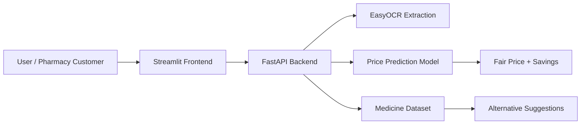

<div align="center">

# 💊 Fair Medicine

### AI-Powered Fair Price & Alternative Prediction Engine

[](https://fair-medicine-ui-9wqmwrtgdxoni8zmki7f47.streamlit.app/)
[](https://fastapi.tiangolo.com/)
[](https://render.com/)
[](https://scikit-learn.org/)
[](https://github.com/JaidedAI/EasyOCR)
[](https://python.org)
[](#license)

[Live Demo](https://fair-medicine-ui-9wqmwrtgdxoni8zmki7f47.streamlit.app/) • [Architecture](#-project-architecture) • [Setup](#-local-setup) • [API](#-api-endpoints)

</div>

---

## Overview

Fair Medicine is a healthcare affordability platform that helps users detect whether a medicine is overpriced and discover cheaper, clinically equivalent alternatives. It combines OCR-based prescription reading, machine learning-based fair price prediction, and a medicine comparison engine to make healthcare decisions more transparent.

This project is designed to reduce medicine cost confusion for patients by identifying:

- overpriced branded medicines,
- affordable alternatives with the same active ingredients,
- fair price estimates based on market patterns,
- medication information from uploaded prescriptions or manual input.

---

## Why this matters

Healthcare affordability remains a major issue, especially when patients buy medicines without knowing whether they are paying too much. In many cases, medicines with the same active ingredients are sold at drastically different prices due to branding, distribution, and market strategy.

Fair Medicine addresses this by combining:

- computer vision for extracting medicine names from prescription images,
- structured price prediction using machine learning,
- alternative matching against a cleaned medicine database.

---

## Features

- 📷 OCR-powered medicine recognition from prescription images using EasyOCR
- 🧠 Fair price prediction using trained ML models
- 💰 Alternative medicine recommendations with cost-saving insights
- 🧾 Support for manual medicine search and ingredient-based matching
- ⚡ FastAPI backend for production-ready predictions
- 🌐 Streamlit frontend for a simple, interactive user experience

---

## Project architecture



```text
fair-medicine-predictio/
├── README.md
├── backend/
│   ├── app.py
│   ├── Dockerfile
│   ├── requirements.txt
│   ├── data/
│   │   └── cleaned_medicines.csv
│   ├── model/
│   │   ├── model.ipynb
│   │   ├── predict.py
│   │   ├── power_transformer.joblib
│   │   ├── preprocessor.joblib
│   │   └── rf_model.joblib
│   └── schema/
│       ├── alternative_response.py
│       └── price_prediction_response.py
├── frontend/
│   ├── app.py
│   ├── requirements.txt
│   ├── data/
│   │   └── cleaned_medicines.csv
│   └── easyocr_data/
└── .gitignore
```

---

## Tech stack

| Layer | Technologies |
| --- | --- |
| Frontend | Streamlit, Python |
| Backend | FastAPI, Pydantic |
| ML | scikit-learn, joblib |
| OCR | EasyOCR |
| Data | Pandas, NumPy |
| Deployment | Render, Streamlit Cloud |

---

## How the system works

### 1. Prescription or medicine input
The user either uploads a prescription image or enters a medicine name manually.

### 2. OCR and text extraction
EasyOCR reads the medicine name and ingredients from the uploaded image.

### 3. Feature engineering and prediction
The backend preprocesses the extracted text and sends it through a trained regression model to estimate a fair price.

### 4. Alternative matching
The system compares the active ingredient and dosage against the cleaned medicine dataset to find cheaper equivalent options.

### 5. Price comparison output
The final response contains:

- predicted fair price,
- current price comparison,
- potential savings,
- alternative medicine list.

---

## Machine learning approach

The project uses a trained ensemble regression model to estimate medicine price based on key attributes such as:

- medicine name,
- active ingredient composition,
- dosage form,
- packaging size,
- manufacturer,
- formulation type.

### Model pipeline

- categorical encoding with `OneHotEncoder`
- skew correction through `PowerTransformer`
- model training using regression-based ensemble methods
- output serialization via `joblib` for fast inference

---

## API endpoints

### GET /health

Checks whether the backend service is healthy.

```json
{
  "status": "healthy",
  "service": "Fair Medicine API",
  "version": "1.0.0"
}
```

### POST /predict-price

Predicts a fair price for a medicine.

```json
{
  "medicine_name": "Augmentin 625 Duo Tablet",
  "salt_composition": "Amoxycillin (500mg) + Clavulanic Acid (125mg)",
  "dosage_form": "Tablet",
  "units_per_pack": 10,
  "manufacturer": "GlaxoSmithKline Pharmaceuticals Ltd"
}
```

Example response:

```json
{
  "medicine_name": "Augmentin 625 Duo Tablet",
  "predicted_fair_price": 142.35,
  "currency": "INR",
  "is_overpriced": true,
  "overpriced_percentage": 38.5
}
```

### POST /find-alternatives

Finds cheaper and medically comparable alternatives.

```json
{
  "salt_composition": "Amoxycillin (500mg) + Clavulanic Acid (125mg)",
  "dosage_form": "Tablet",
  "limit": 3
}
```

Example response:

```json
{
  "query_composition": "Amoxycillin (500mg) + Clavulanic Acid (125mg)",
  "alternatives_count": 2,
  "alternatives": [
    {
      "brand_name": "Moxikind-CV 625 Tablet",
      "manufacturer": "Mankind Pharma Ltd",
      "price": 95.5,
      "estimated_savings_percentage": 52.4
    }
  ]
}
```

---

## Local setup

### Prerequisites

- Python 3.10+
- Git
- Virtual environment support

### 1. Clone the repository

```bash
git clone https://github.com/sujal-jangir-111/fair-medicine-prediction.git
cd fair-medicine-prediction
```

### 2. Set up the backend

```bash
cd backend
python -m venv venv

# Windows (PowerShell)
.\venv\Scripts\Activate.ps1

# Linux/macOS
source venv/bin/activate

pip install --upgrade pip
pip install -r requirements.txt
uvicorn app:app --reload --host 127.0.0.1 --port 8000
```

API docs: http://127.0.0.1:8000/docs

### 3. Set up the frontend

```bash
cd ../frontend
python -m venv venv

# Windows (PowerShell)
.\venv\Scripts\Activate.ps1

# Linux/macOS
source venv/bin/activate

pip install --upgrade pip
pip install -r requirements.txt
streamlit run app.py
```

Frontend URL: http://localhost:8501

---

## Deployment

### Backend
The backend can be deployed using Render or any similar Python hosting provider.

Example startup command:

```bash
uvicorn app:app --host 0.0.0.0 --port $PORT
```

### Frontend
The frontend is designed for deployment on Streamlit Cloud and can consume the backend API via an environment variable such as:

```bash
BACKEND_API_URL=https://your-api-url.onrender.com
```

---

## Roadmap

- 🌍 Add multilingual OCR support for regional languages
- 📱 Build a mobile-friendly interface
- 🧾 Integrate barcode and QR-based drug detection
- 🏛️ Connect with official medicine pricing and regulatory APIs
- 🧪 Improve prediction quality with richer datasets and advanced models

---

## License

This project is licensed under the MIT License.

---

## Author

Built and maintained by Sujal Jangir.

- GitHub: @sujal-jangir-111
- Demo: [Streamlit App](https://fair-medicine-ui-9wqmwrtgdxoni8zmki7f47.streamlit.app/)

---

## Acknowledgments

This project uses:

- FastAPI for API development
- Streamlit for interactive UI
- EasyOCR for prescription image reading
- scikit-learn for machine learning pipelines
- Python ecosystem libraries for data processing and deployment

If you want, I can also make this README even more premium by adding a custom banner section, a better architecture diagram, and a more polished project summary for GitHub profile and portfolio use.
 